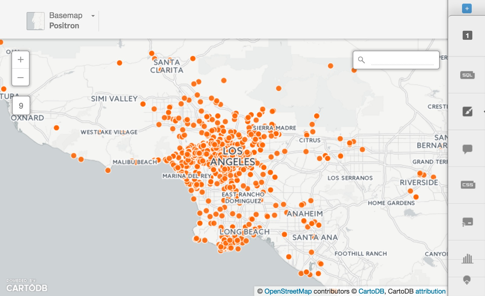
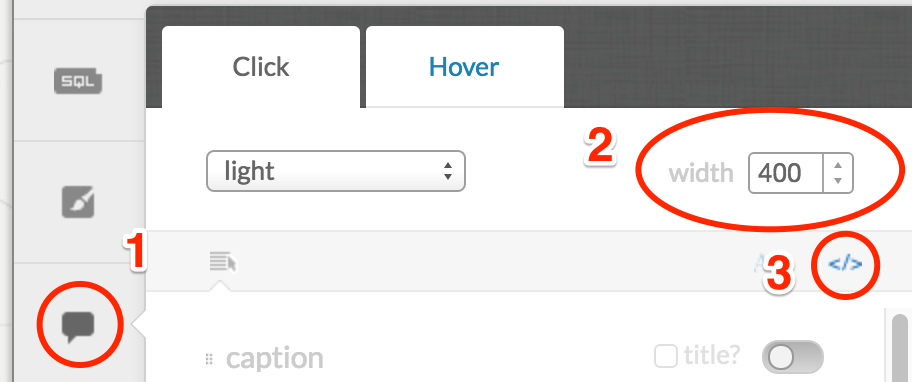
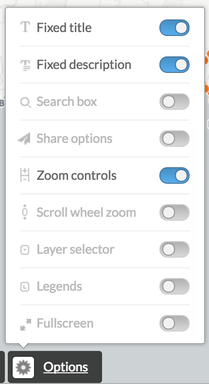

#### Adding your own data

1. Download the class dataset here: [LA Times Photo Archive](https://ucla.box.com/s/8iqzhhb2fw8wb4ur81e7irt4khuvvfqs)
2. In CartoDB, go back to your dashboard.  If you are in DATA or MAP edit mode, click on the bent arrow at the top left of your window. This will take you to your dashboard: 
3. If you are in Maps view, make sure to switch to Datasets view 
4. Click on the new dataset button 
5. Find and add the class dataset that you downloaded, and click on the "Connect dataset" button
6. Inspect the data in data view (what do you notice?), and then switch to "MAP VIEW"
7. Navigate the map until you are centered in Los Angeles

### Creating interactivity

We would like a photo to appear when we hover over each marker. Also, if you click on a marker, we would like the popup window to show a larger photo.

1. Click on the infowindow icon
2. Change the width to 400
3. Click on the "change HTML" button
    
    
4. Type the following code into the custom HTML window:
    
    

        <a href\="#close" class\="cartodb-popup-close-button close"\>x</a\>
        

            

                <p\>{{title}}</p\>
                <a href\="{{imageurl}}" target\="\_blank"\>
                    
                </a\>
            </div\>
        </div\>
        
</div\>
    </div\>
    
5. Switch to the "Hover" tab
6. Click on the "Change HTML"
7. Enter the following code:
    
    

        

            <p\></p\>
        </div\>
    </div\>
    

### Publish your map

1. Find and click the "VISUALIZE" button on the top right hand corner of the page
2. Click the "OK, CREATE MAP" button
3. Click the "Edit metadata..." link
    
    
4. Add a title (Map Name) and Description and save
5. Go to "Options" and add "Fixed title" and "Fixed description"
    
    
6. Find and click the "PUBLISH" button on the top right hand corner of the page
7. Notice the different options to publish your map.
