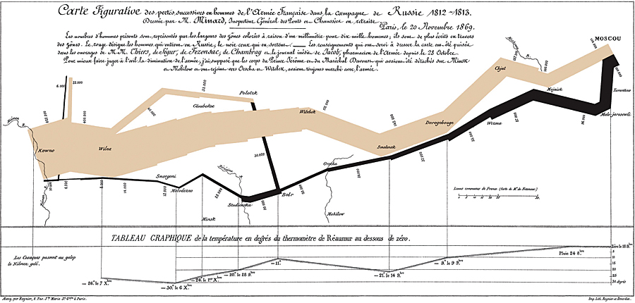
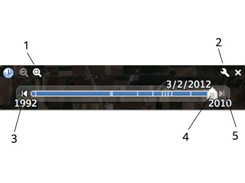

### To start, navigate to this page via the URL below:

[http://sandbox.idre.ucla.edu/sandbox/history-of-digital-mapping](http://sandbox.idre.ucla.edu/sandbox/history-of-digital-mapping)

\[iframe src="http://cdn.knightlab.com/libs/timeline3/latest/embed/index.html?source=1hiGBK61NxrIsl2R-Vd\_ajLQCbUvr9FLIKPmoJMRqRBI"\]

### "What is a map? What is _in_ a map? _How_ do you map?"

In the Humanities, mapping can be defined in so many different ways, there is no easy answer to these questions. In fact, your research can dictate the parameter of choices that define _your_ map. Below are a few examples of just how multi-faceted mapping can be for any discipline, and how the _digital_ can help scope and develop innovative approaches to projects. How then might _your_ project utilize these tools?

# Lecture on Mapping Space and Time

> "Everything is related to everything else, but near things are more related than distant things." -Waldo Tobler

Waldo Tobler's statement defines his first law of geography, in ways stating the obvious correlation between objects in space, paving the foundation behind spatial dependencies. Equally important, we may argue, is that the same dependencies that exist in space also exist in time. Chronology is a representation of sequential data as spatial overlays, often visualized to show relationships, dependencies, and causation through time.

One other issue to note is that maps are a 3D projection on to a 2D surface, what results is a distortion based on the following:

1. Distance
2. Direction
3. Shape
4. Area

In short, in order to preserve one of these elements with highest fidelity, the other elements are to be sacrificed to some degree.

## John Snow

While maps have existed throughout human history, the “John Snow Cholera Map” from 1854 illustrates the first time that a map was used to spatially analyze a phenomenon; in this case a cholera outbreak within London. In order to produce this map a couple of pieces of geographic information needed to come together:

1. The spatial data on where the deaths occurred
2. An accurate representation of the street network and buildings
3. Locations of the handpumps used to get water from.

Each line represents a death, and a concentration can be seen around a certain street. After having identified the problem, this map allowed Snow to write a letter to the authorities and prompted the end of cholera outbreaks in the locale.

## Minard

The representation of 3 dimensional space onto a flat, 2 dimensional platform–a map–brings with it many challenges and compromises (e.g. projection systems). Every "flat" map in existence compromises on one geographical element: **S**hape, **A**rea, **D**istance or **D**irection. So too, does the representation of the "fourth dimension", or time, bring about much to contemplate on how best to summarize and eventually effectively visualize geo-temporal data. Historically, inventive methods employed in visualizing change over time has produced infamous graphics such as Minard's map of Napoleon's Russian Campaign in 1812.

# The Digital Revolution

## ESRI's ArcInfo and ArcView

While previous cartographic maps were done by hand, increasingly as computer processing became more powerful, spatial information began to be "digitized". Whether it be from tracing old paper maps, or redoing them anew, spatial processing began to take off with the advent of ESRI's ArcInfo command-line based software.

## Xerox PARC Map Viewer

This map viewer was the first of its kind to debut to the young World Wide Web in 1993. The signified the transition to a digital age where spatial information could be shared online.

## MapQuest

The rapid development of the Internet allowed a new space for mapping on the web to be explored, not just as static gifs, like in the PARC map viewer, but rather as zoomable and pannable images; MapQuest was the first online mapping platform to do so.

## Google Earth

After Google acquired Keyhole in 2004, their application was re-branded as Google Earth; a standalone application for interrogating the entire planet.

Among one of the many new features implemented, a time slider was also included to sift through historic imagery. The obvious choice to represent time via an interface is to provide some sort of time dial, a time-machine of sorts that allows you to punch in a past (or future) date, and navigate to that time to present information relevant to that temporal space. Interactive time representations are made possible via a myriad of functional visual widgets. Most popular are the time sliders that allow users to navigate into the past by "sliding" a set of handles to go back (or forward) in time. Google Earth uses such a slider effectively to navigate time:

The advantage of dynamic time sliders is that they are malleable, they adjust to the time spans dictated by the content material. In the screen shot from Google Earth, the time slider itself is indicative of the content being provided, in this case, we can depict that this particular location has historical satellite image dating back to 1992.

## OpenStreetMap and Google Maps

These are "slippy" maps that came out within a year of a each other and pioneered the idea of seamlessly moving around a map of the world.

# Digital Mapping Evolved

## Hans Rosling

Equally inventive and in ways revolutionary to the modern day digital world was the wizardry employed by the exuberant "Jedi Master of data visualization", Hans Rosling. His [legendary TED talk](http://www.ted.com/talks/hans_rosling_shows_the_best_stats_you_ve_ever_seen) in 2006 was premised by a tool he created called [Gapminder](http://www.gapminder.org/), later to be [bought out by Google in 2007](http://venturebeat.com/2007/03/19/google-buys-gapminder-a-graphical-display-company/). As a data visualization tool, Gapminder cleverly incorporates temporal global data on a 2D bubble chart, utilizing choreographed animation sequences to depict change over time. Spatiality is defined by a bubble-per-country, and via the colors of the bubbles, each swath representing a geographic region. Yet, what makes this representation of information compelling is not just in its ability to animate data over time, but more so in its ability to _interact_ with time, pausing, rewinding, forwarding, slowing down and speeding up.

## Hypercities

> I turn off Google Maps and start to drive. I wonder: what would it mean to drive downward, into the buried pasts that persist somewhere—in the imagination, in the archive, in the memories of others, in the traces of places long gone and lost? Who used to live here? What used to be there? What’s buried under this freeway, under this skyscraper, beneath these overpasses? What has vanished imperceptibly from the surface of the earth? What voices and ghosts haunt, however imperceptibly, these concrete landscapes? Why do I care? It’s a past which is, ostensibly, not my own. I don’t recognize it. It’s not mine. Time is out of joint. - _Todd Presner (HyperCities, Thick Mapping in the Digital Humanities)_

Perhaps one of the most innovative geotemporal platforms born and created within academia is [HyperCities](http://www.hypercities.com), the brainchild of our very own Todd Presner. In his words, here is how Todd describes the Hypercities platform:

> Built on the idea that every past is a place, HyperCities came to life as a digital research and educational platform for exploring, learning about, and interacting with the layered histories of city and global spaces. Developed though collaboration between UCLA, USC, CUNY, and numerous community- based organizations, the fundamental idea behind HyperCities is that all histories “take place” somewhere and sometime, and that they become more meaningful when they interact and intersect with other histories. Through the Google Maps and Earth APIs, HyperCities essentially allows users to go back in time to create, narrate, and explore the historical layers of city spaces and tell stories in an interactive, hypermedia environment.

The idea that we can spiral downwards–or upwards–from any location to navigate into the past or future is at the core of the HyperCities platform, to the degree that technology can allow such a concept to manifest.

HyperCities Map Library:

[http://www.hypercities.com/maplibrary/maplibrary.html](http://www.hypercities.com/maplibrary/maplibrary.html)

## CartoDB

Perhaps signaling a new wave of geotemporal platforms, CartoDB emerged onto the scene in 2012, when it's platform was launched at the Where 2.0 conference. Unlike other emerging online mapping platforms such as Leaflet and Mapbox, CartoDB prides itself in its database driven mapping approach, built on an open source backend of PostGIS and PostGRESQL.

## Timeline JS

Temporal platforms seemingly entered a lull after SIMILE, signaling an end of an era for innovations in time-based visualizations. Several notable libraries have emerged, most notably [Timeline JS](http://timeline.knightlab.com/), produced by Northwestern Univesity's Knight Lab, which capitalizes on the increased usage of cloud technologies by academics and journalists alike. Timeline JS capitulates on the popularity of Google Docs, cleverly utilizing the Spreadsheet API to link data directly into its visually appealing timeline, allowing one to manipulate data dynamically, effectively utilizing it as a database driving the web interface. However, its dependency on Google, coupled with the timeline's inability to scale time beyond a single day.

##  Hands-on: Mapping Maps

Mapbox: [https://www.mapbox.com/](https://www.mapbox.com/) | [port data](http://sandbox.idre.ucla.edu/Workshops/Getty2015/mapbox/LocationsAncientWorld.csv)

ESRI Story Map: [http://storymaps.arcgis.com/en/app-list/](http://storymaps.arcgis.com/en/app-list/) | [port data](http://sandbox.idre.ucla.edu/Workshops/Getty2015/esristorymap/LocationsAncientWorld.csv)

GoogleEarth: [https://www.google.com/earth/](https://www.google.com/earth/) | [coin data](http://sandbox.idre.ucla.edu/Workshops/Getty2015/googleearth/S%20Coupland%202013%20-%20Geodatabase%20of%20Carolingian%20Hoards%20-%20AD%20751-987%20(v%201-1).kml)

.kml)

NYPL map warper: [http://maps.nypl.org/warper/](http://maps.nypl.org/warper/)

CartoDB: [https://cartodb.com/](https://cartodb.com/) | [coin data](http://sandbox.idre.ucla.edu/Workshops/Getty2015/cartodb/S%20Coupland%20Carolingian%20Hoards%20-%20AD%20751-987vAlbert.csv)

## Visualizing Data

Google Fusion Tables: [https://www.google.com/fusiontables/](https://www.google.com/fusiontables/) | [coin data](http://sandbox.idre.ucla.edu/Workshops/Getty2015/fusiontables/S%20Coupland%20Carolingian%20Hoards%20-%20AD%20751-987vAlbert.csv)

Palladio: [http://palladio.designhumanities.org/](http://palladio.designhumanities.org/) | [ship wreck data](http://sandbox.idre.ucla.edu/Workshops/Getty2015/palladio/Michael%20McCormick%20et%20al.,%20Summary%20Geodatabase%20of%20Shipwrecks%20AD%201-1500,%20Status%202008.csv)

[Doarama](http://www.doarama.com/info)

The future of digital mapping is exciting, and Doarama is an example which marries temporality, with video, and spatial data.
