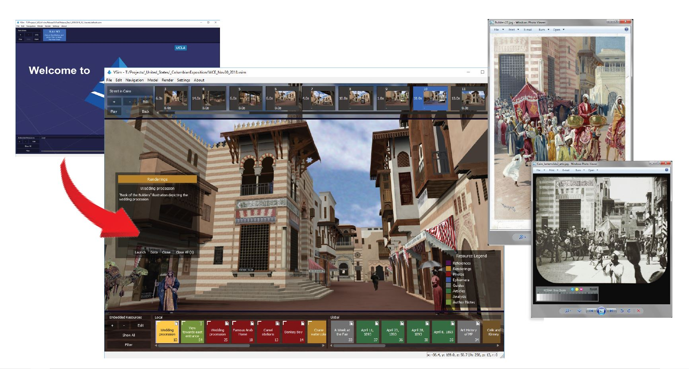

## VSim 2.0 BETA Now Available!
VSim facilitates the real-time exploration of highly detailed, three-dimensional computer models in both formal and informal educational settings. Funded by a Digital Humanities Implementation Grant from the National Endowment for the Humanities, this software addresses the greatest challenge for building knowledge through the use of three-dimensional computer models by providing scholars and educators the mechanism to explore, annotate, craft narratives, and build arguments within the 3D space – in essence, facilitating the creation of virtual learning environments that can be broadly disseminated to educators and learners across grade levels and humanities disciplines.

Beyond real-time interaction with three-dimensional content, the software offers two critical functions for academic use of interactive computer models: the narrative feature that allows users to create linear presentations within the virtual space (think PowerPoint or Prezi within a three-dimensional world), and the embedded resources feature that allows users to embed annotations and links to primary and secondary resources within the virtual environment.

The new VSim 2.0 software, a sample model file, and a users guide are available on the VSim Downloads page.

Posted March 19, 2014: VSim_TheMovie is a 12 minute video piece that illustrates the key features of the VSim prototype (similar enough to VSim 2.0 to be useful).

FAQs and known bugs for VSim 2.0 will be described on the VSim FAQs page; those currently listed are for the prototype (v 1.2.1.).

PIs for the VSim project are Institute for Digital Research and Education technologists Drs. Scott Friedman and Lisa M. Snyder. David Stephan was the lead programmer on the VSim 2.0 development. Other 2.0 team members were Francesca Albrezzi, Aaron J. Taber, and Sam Amin. Dr. Elaine Sullivan and Joy Guey provided UX consultation, and computer science graduate students Eduardo Poyart, Franklin Fang, and XinLi Cai built the VSim prototype. VSim is funded by the National Endowment for the Humanities.